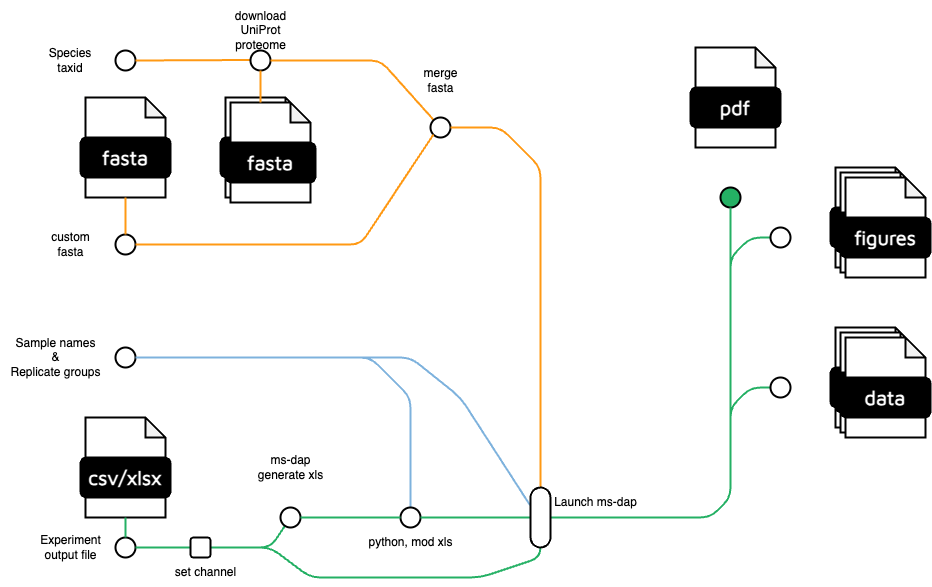

# dsp_nf-msdap
Nextflow pipeline for MS-DAP, a downstream pipeline to generate statistical PDF reports for MS data

This repository aims to serve as a headless launcher for msdap - https://github.com/biosustain/msdap 

This very early development verion is only compatible with Spectronaut output, but all formats supported by msdap will be compatible with the final version.

to generate a pdf report with MS-DAP, the following are needed:

* Mass Spec report as would be needed for MS DAP.
* Fasta file with proteome / TAXID for species to autodownload from Uniprot.
* ordered list of replicate group names.

The enviromnent running this script will need following dependencies:

* Nextflow
* Docker with min 16 gb of ram for the R installation with MS-DAP
* python3 with pandas


Example to initiate this pipeline (9606 indicates that proteome for human will be downloaded):

```
./nextflow run flow_main.nf ## nexflow workflow file
--library reference ## Directory where the reference proteomes and fasta files should be found/downloaded
--force.download False ## Whether to force download of fasta file
--taxid 9606 ## NCBI Taxonomic identifier of studied organism
--file [full_path]/data/DIA_Report.csv ## Processed proteomics file (e.g., output spectronaut)
--groups [full_path]/data/groups.xlsx ## File specifying conditions to be contrasted
--format spectronaut ## Format of the proteomics file
```

content of groups.xlsx:
```
sample_id / group
```


Attributions: 
Metromap adapted in part with remixed components from nf-co.re/sarek 
